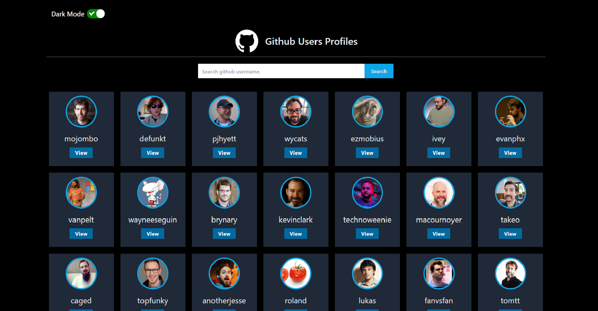

<h1 align=center >Github Profiles</h1>

<h3 align=center>Link to App: github-profiles-bragadeeshan.netlify.app </h3>

  

### Tecnologies used:
- React JS
- TailwindCss

## User Stories

-   [x] User can enter a username
-   [x] User can click on search button to retrieve information
-   [x] User can see the avatar, username, followers and repository count of searched user
-   [x] User can see the top 4 repositories of searched user
-   [x] User should get an alert if the username is not valid

## Bonus features
-  [x] User can toggle dark/light mode
-  [x] Selected mode should persist when user comes back to the app again
